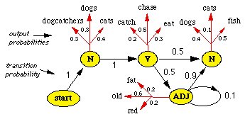
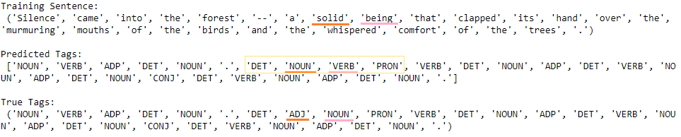

# Part-of-Speech Tagging with Hidden Markov Model using pomegranate library

* This is my implementation of Part-of-Speech Tagging with Hidden Markov Model (HMM), using **pomegranate library** that enables constructing a hidden markov model with hidden states and correspoding transition and emission probabilites. 

* **Brown Corpus** containing ~53,000 sentences including ~1,160,000 words was used as input data. 
* The final part-of-speech predictions for each word in the corpus was done using **viterbi path** algorithm.

## Results

For training set of 928,458 words and test set of 232,734 words, resulting HMM model yielded **training accuracy of 97.54%** and **test accuracy of 96.02%**.

Here is a sample of a sentence with some incorrectly predicted tags:

It can be seen that although the two underlined tags were incorrectly predicted , if we look at the surrounding predictions ('DET', 'NOUN', 'VERB', 'PRON')
in the yellow square, the sequence actually makes sense if we look at it by itself. We can match expressions with correspoding tags, 
such as "a man stated that" or "the doctor saw that". Thus, HMM model still succeeded in producing reasonable predictions locally, although it failed to do so
globally within the whole sentence. 

## Sources

I referenced Udacity's Natural Language Processing Nanodegree's workspace.

